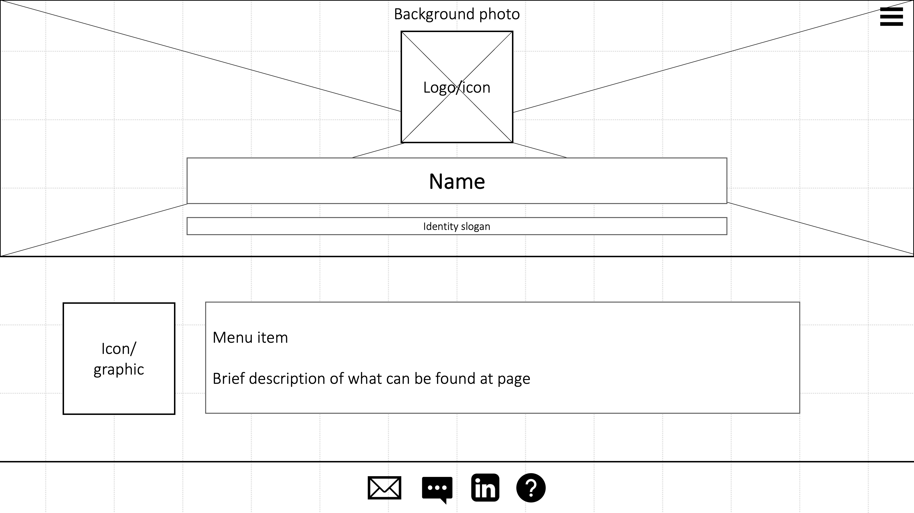
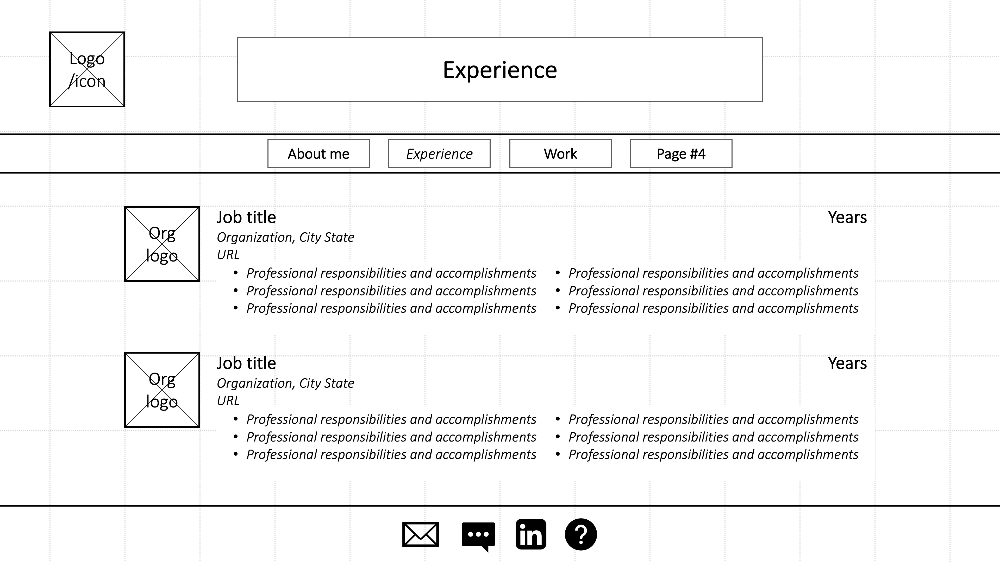
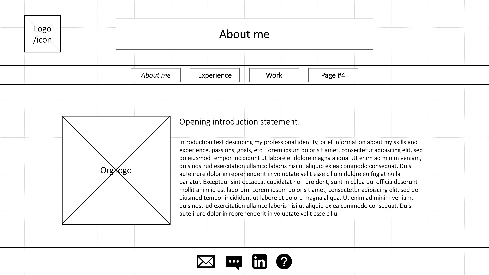

# Jessica Best INF6420 Project

A resume/portfolio site showing my professional experience, demonstrating my professional skills and experience (particularly those outside of social work), and articulating the unique value I bring as a professional straddling social work, academia, and information management, design, and communication. 

## Wireframes

### Homepage

The homepage will serve to introduce the user to my professional identity, visual brand, and pique the interest of the user with attractive yet simple and efficient style.

Header: The version of the header on the homepage will be expanded. It will have a decorative background photo appropriate for being behind logo and text. The logo will represent my name/professional brand. My name will appear at the top along with an identity slogan quickly introducing users to my professional identity.

Navigation menu: Because the menu items will populate the main content of the page, the navigation menu will not appear in full. However, a hamburger menu option will appear in an expected place in the header to allow users to elect to see the navigation menu.

Main content: The main content of the homepage will consist of links to the menu items with descriptions of what can be found on those pages and some sort of decorative icon or graphic to represent the content of the page in an attractive way. Each section will have the same format and users will navigate the sections by scrolling.

Footer: The footer will remain consistent across the site and will contain icons for contact methods, each of which will be spelled out with a tooltip. For example, the tooltip when the user is hovering over the email icon will read "Send Jessica an email" or something along those lines. 

### Experience

The experience page will serve as a virtual resume.

Header: The header will be on all pages other than the homepage, will take up less vertical space than the homepage header. It will include my logo, which will link back to the homepage. It will include the title of the page and the full navigation menu.

Navigation menu: The full navigation menu will appear on all pages but the homepage. It will contain the page names that link to those pages. All menu items will appear on the menu, including the page users are on highlighted in some way.

Main content: The main content of the experience page will serve as a virtual resume, with an option to download a PDF of my resume, with icons/logos where applicable. 

Footer: The footer will remain consistent across the site and will contain icons for contact methods, each of which will be spelled out with a tooltip. For example, the tooltip when the user is hovering over the email icon will read "Send Jessica an email" or something along those lines. 

### About

The about page will serve to show users my professional identity and unique assets as a professional straddling multiple arenas. It will also contain some information about my personal identity for fun to help users connect with me as a person.

Header: The header will be on all pages other than the homepage, and will take up less vertical space than the homepage header. It will include my logo, which will link back to the homepage. It will include the title of the page and the full navigation menu.

Navigation menu: The full navigation menu will appear on all pages but the homepage. It will contain the page names that link to those pages. All menu items will appear on the menu, including the page users are on highlighted in some way.

Main content: The main content of the about page will be paragraphs and images to represent my professional identity, provide narrative about my professional experience and work, and speak to my abilty to straddle social work research, communications, information management and design. The content will aim to articulate my unique professional value.  

Footer: The footer will remain consistent across the site and will contain icons for contact methods, each of which will be spelled out with a tooltip. For example, the tooltip when the user is hovering over the email icon will read "Send Jessica an email" or something along those lines. 